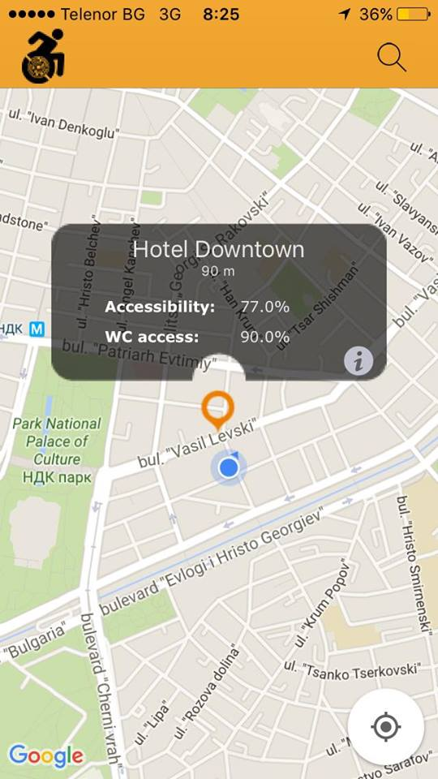
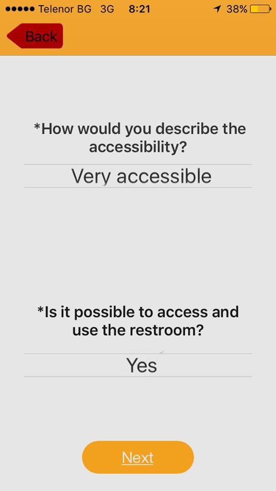
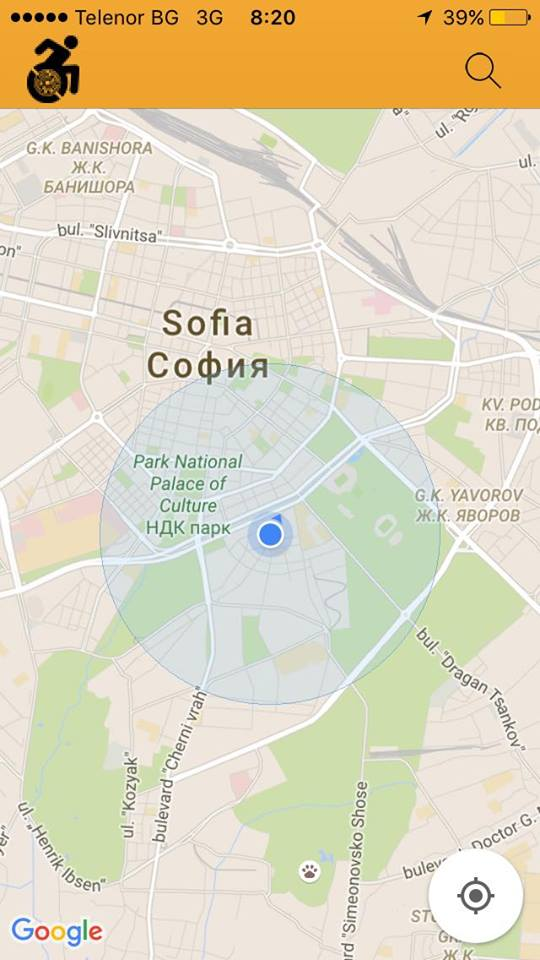
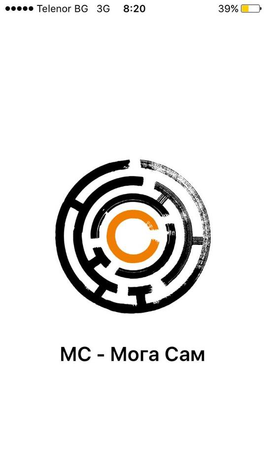

# Enabled
-
Course project for Telerik Academy iOS Development Course

##The Idea

"Enabled" is an application that aims to provide information about places accessibility for wheelchair users. The app is working with Google Maps and Google Places Sdk.

##Functionality
The user mainly interacts with a map view and can observe nearby places and search for specific address.

Every place can be rated depending on its level of accessibility and the average accessibility level is calculated based on the number of votes. In addition there is special rating for the restroom accessibility of a place because this is a very large problem people with disabilities face on an everyday basis.
A place can also be reviewed and can have images.

When a place is found on the map a custom info window shows the information. Long press gesture on it triggers voice reading of the inforation: distance from current location and accessibility percentage. A tap on the info window leads the user to the place information page.

The application uses:
--

* Firebase as a backend
* Google Maps API & Google Places SDK for iOS
* Custom View for Map Markers

Device APIs:

* Camera and Gallery
* Geolocation
* Connection
* Siri

UI:

* Custom Info Window and Map Markers
* Auto Layout and adaptive to different screen sizes design
* Swipe gestures 

--

In addition to this I am connecting the project to my work in "MS-Moga Sam" foundation based in Sofia, Bulgaria. The purpose of our work is to help people diagnosed with Multiple Sclerosis and other disabilities as well. We provide information about living with disabilities and alternative treatments, we raise awareness about the important role that diet and exercise play in being healthy, we organise support networks and search for ways to assist people on everyday basis. Last but not least, “MS - Moga Sam” fights for creating better accessibility for everyone.

[github repository link](https://github.com/alaraKalama/Enabled)